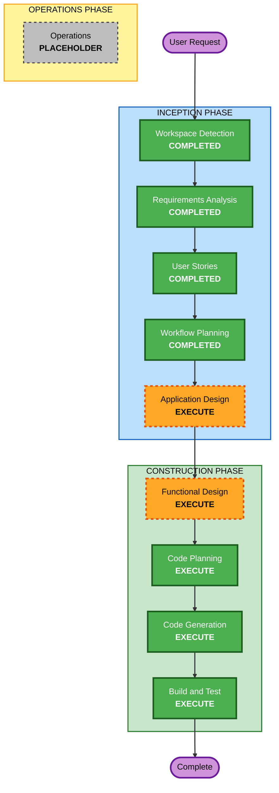

# Execution Plan

## Detailed Analysis Summary

### Change Impact Assessment
- **User-facing changes**: Yes - 新規 Electron アプリケーション全体がユーザー向け
- **Structural changes**: Yes - Electron + React + TypeScript の新規アーキテクチャ構築
- **Data model changes**: No - データベース不使用、.env による設定管理のみ
- **API changes**: Yes - LM Studio (OpenAI互換) / Gemini API との外部連携
- **NFR impact**: Yes - API キーのセキュリティ管理、Electron セキュリティ設定、ローディング UX

### Risk Assessment
- **Risk Level**: Low
  - グリーンフィールドプロジェクト（既存システムへの影響なし）
  - 成熟した技術スタック（Electron + React + Vite）
  - 外部API連携は既存ライブラリで対応可能
- **Rollback Complexity**: Easy（新規プロジェクトのためいつでもリセット可能）
- **Testing Complexity**: Moderate（LLM API連携のモック/スタブが必要）

## Workflow Visualization



### Text Alternative
```
Phase 1: INCEPTION
  - Stage 1: Workspace Detection (COMPLETED)
  - Stage 2: Requirements Analysis (COMPLETED)
  - Stage 3: User Stories (COMPLETED)
  - Stage 4: Workflow Planning (COMPLETED)
  - Stage 5: Application Design (EXECUTE)
  - Reverse Engineering (SKIP - Greenfield)
  - Units Generation (SKIP - Single app)

Phase 2: CONSTRUCTION
  - Stage 6: Functional Design (EXECUTE)
  - NFR Requirements (SKIP - Requirements sufficiently covered)
  - NFR Design (SKIP - No NFR Requirements)
  - Infrastructure Design (SKIP - Desktop app)
  - Stage 7: Code Planning (EXECUTE - ALWAYS)
  - Stage 8: Code Generation (EXECUTE - ALWAYS)
  - Stage 9: Build and Test (EXECUTE - ALWAYS)

Phase 3: OPERATIONS
  - Operations (PLACEHOLDER)
```

## Phases to Execute

### INCEPTION PHASE
- [x] Workspace Detection (COMPLETED)
- [x] Reverse Engineering - SKIP
  - **Rationale**: グリーンフィールドプロジェクトのため不要
- [x] Requirements Analysis (COMPLETED)
- [x] User Stories (COMPLETED)
- [x] Workflow Planning (COMPLETED)
- [ ] Application Design - EXECUTE
  - **Rationale**: 新規コンポーネント設計が必要（Main/Renderer Process、IPC通信、LLM APIクライアント、プロバイダー切り替えインターフェース）
- [ ] Units Generation - SKIP
  - **Rationale**: 単一 Electron アプリケーションで完結。複数サービス/モジュールへの分割不要

### CONSTRUCTION PHASE
- [ ] Functional Design - EXECUTE
  - **Rationale**: LLMプロバイダー切り替えロジック、IPC通信データフロー、校正プロンプト設計等のビジネスロジック詳細設計が必要
- [ ] NFR Requirements - SKIP
  - **Rationale**: NFR要件は requirements.md で十分にカバー済み（セキュリティ: contextIsolation/APIキー管理、ユーザビリティ: ローディング表示）
- [ ] NFR Design - SKIP
  - **Rationale**: NFR Requirements をスキップするため不要
- [ ] Infrastructure Design - SKIP
  - **Rationale**: ローカルデスクトップアプリケーションのためクラウドインフラ設計は不要
- [ ] Code Planning - EXECUTE (ALWAYS)
  - **Rationale**: 実装アプローチの計画が必要
- [ ] Code Generation - EXECUTE (ALWAYS)
  - **Rationale**: コード実装が必要
- [ ] Build and Test - EXECUTE (ALWAYS)
  - **Rationale**: ビルド、テスト、検証が必要

### OPERATIONS PHASE
- [ ] Operations - PLACEHOLDER
  - **Rationale**: 将来のデプロイ・監視ワークフロー用プレースホルダー

## Success Criteria
- **Primary Goal**: macOS ディクテーション入力テキストを LLM で校正できる Electron アプリの構築
- **Key Deliverables**:
  - 動作する Electron アプリケーション（macOS）
  - 2カラム UI（入力パネル / 校正結果パネル）
  - LM Studio / Gemini API の切り替え対応
  - クリップボードコピー機能
- **Quality Gates**:
  - LLM API との正常な通信
  - 日本語・英語テキストの校正動作確認
  - Electron セキュリティベストプラクティスの遵守
  - エラー時の適切なメッセージ表示
